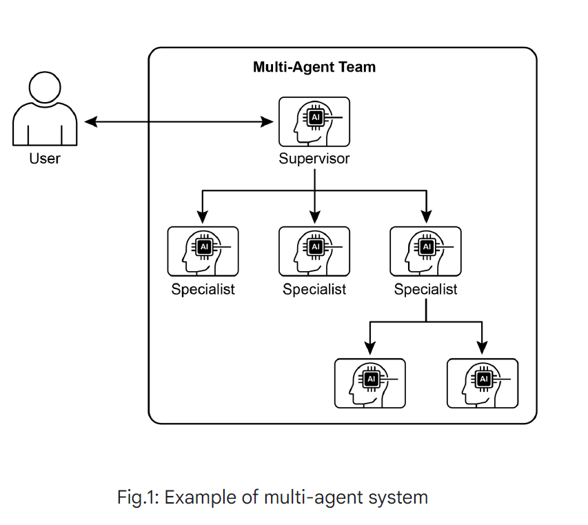

# Multi-Agent Collaboration Patterns

This directory contains implementations and examples of various multi-agent collaboration patterns used in AI systems.

## Patterns Overview

### 1. Sequential Handoffs
Agents work in a pipeline where each agent completes their task and passes the result to the next agent in sequence. This pattern ensures ordered processing and clear responsibility chains.

### 2. Parallel Processing
Multiple agents work simultaneously on different aspects of the same problem or different problems entirely. Results are then combined or processed independently.

### 3. Debate and Consensus
Agents engage in structured discussions, presenting different viewpoints or solutions. Through debate and negotiation, they reach a consensus or select the best approach.

### 4. Hierarchical Structure
Agents are organized in a hierarchy with manager agents coordinating and delegating tasks to worker agents. This enables complex task decomposition and management.

### 5. Expert Teams
Specialized agents with domain expertise collaborate on problems requiring diverse knowledge. Each agent contributes their specialized skills to solve complex, multi-domain challenges.

### 6. Critic-Reviewer
One or more agents generate solutions while critic agents review, evaluate, and provide feedback. This creates an iterative improvement process through constructive criticism.

