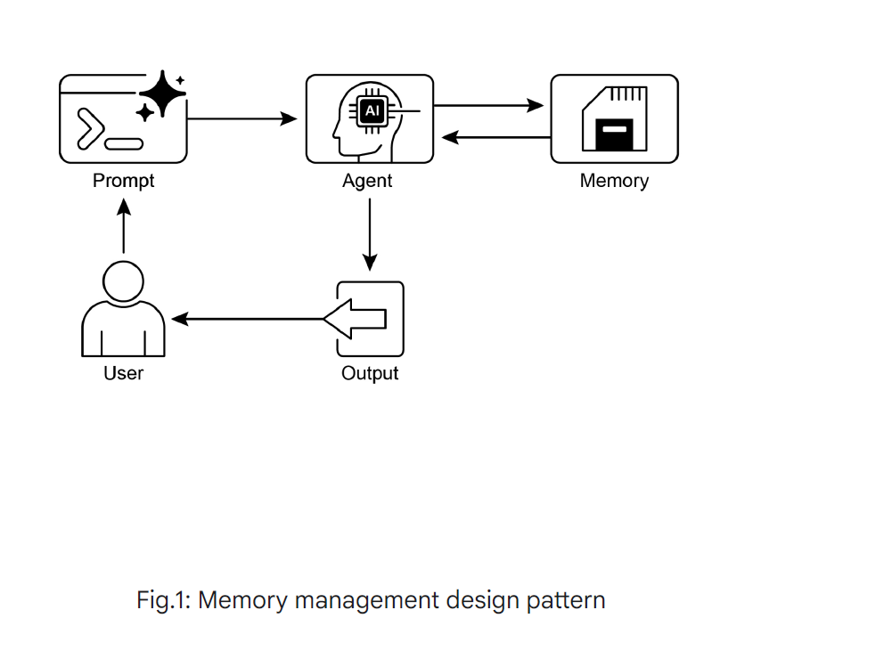

# Memory Management Pattern



## Overview

Memory management is a fundamental design pattern for AI agents that need to maintain context, learn from interactions, and provide personalized experiences. This pattern implements both short-term memory for immediate conversational context and long-term memory for persistent knowledge across sessions.

## Key Concepts

### Short-Term Memory
**Immediate Context Management**
- Maintains conversational context within a single session
- Limited by LLM context window constraints
- Temporary and session-specific
- Handles immediate dialogue flow and task continuity

### Long-Term Memory
**Persistent Knowledge Storage**
- Stores information across multiple sessions
- Uses external storage systems (vector databases, knowledge graphs)
- Enables learning and personalization
- Searchable and retrievable knowledge base

## Memory Architecture Components

### 1. Session Management
- **Session**: The entire chat thread or conversation instance
- **State**: Temporary data storage during a session
- **History**: Chronological record of events and interactions

### 2. Memory Services
- **Memory Storage**: Persistent storage for long-term knowledge
- **Memory Retrieval**: Semantic search and knowledge lookup
- **Memory Updates**: Adding, modifying, and organizing memories

### 3. Context Integration
- **Context Window Management**: Optimizing information within LLM limits
- **Memory Injection**: Strategically adding relevant memories to prompts
- **Relevance Filtering**: Selecting most pertinent memories for current context

## Implementation Strategies

### ADK (Agent Development Kit) Approach

#### Session and State Management
```python
# Session state management with prefixes
session.state = {
    "user:preferences": {},     # User-specific data
    "app:current_task": "",     # Application state
    "temp:working_data": {}     # Temporary processing data
}

# Update state using EventActions
EventActions.state_delta({
    "user:last_query": user_input,
    "app:processing_step": 2
})
```

#### Memory Service Integration
```python
# Store long-term memory
memory_service.store({
    "content": "User prefers technical explanations",
    "metadata": {"user_id": "123", "category": "preference"}
})

# Retrieve relevant memories
relevant_memories = memory_service.search("technical preferences")
```

### LangChain Memory Systems

#### Conversational Buffer Memory
```python
from langchain.memory import ConversationBufferMemory

memory = ConversationBufferMemory(
    memory_key="chat_history",
    return_messages=True
)

# Automatically maintains conversation history
chain = ConversationChain(
    llm=llm,
    memory=memory,
    verbose=True
)
```

#### Custom Memory Implementation
```python
from langchain.schema import BaseMemory

class PersonalizedMemory(BaseMemory):
    def __init__(self):
        self.short_term = []
        self.long_term_store = VectorStore()
    
    def save_context(self, inputs, outputs):
        # Save to short-term memory
        self.short_term.append({
            "input": inputs,
            "output": outputs,
            "timestamp": datetime.now()
        })
        
        # Optionally persist important info
        if self._is_important(inputs, outputs):
            self.long_term_store.add(outputs)
```

### LangGraph Advanced Memory

#### Semantic Memory Store
```python
from langgraph.store import InMemoryStore

# Create persistent store
store = InMemoryStore()

# Store semantic facts
store.put(
    namespace="user_facts",
    key="preferences",
    value={"style": "technical", "level": "advanced"}
)

# Retrieve and use in graph
def memory_node(state):
    user_prefs = store.get("user_facts", "preferences")
    # Adapt response based on stored preferences
    return {"response": personalized_response}
```

## Memory Types and Use Cases

### 1. Episodic Memory
**What happened when**
- Conversation history
- Event sequences
- Temporal context
- User interaction patterns

**Implementation:**
```python
episodic_memory = {
    "timestamp": "2024-01-15T10:30:00Z",
    "event": "user_asked_question",
    "context": "technical_support_session",
    "outcome": "problem_resolved"
}
```

### 2. Semantic Memory
**Facts and knowledge**
- User preferences
- Domain knowledge
- Learned associations
- Factual information

**Implementation:**
```python
semantic_memory = {
    "concept": "user_communication_style",
    "attributes": {
        "formality": "casual",
        "detail_level": "high",
        "preferred_examples": "real_world"
    }
}
```

### 3. Procedural Memory
**How to do things**
- Learned workflows
- Process optimizations
- Behavioral patterns
- Skill improvements

**Implementation:**
```python
procedural_memory = {
    "procedure": "code_review_process",
    "steps": [
        "check_syntax",
        "verify_logic",
        "test_edge_cases",
        "optimize_performance"
    ],
    "success_rate": 0.95
}
```

## Best Practices

### 1. Memory Lifecycle Management
- **Retention Policies**: Define when to keep, archive, or delete memories
- **Privacy Controls**: Implement user data protection and deletion rights
- **Memory Consolidation**: Merge and optimize stored information

### 2. Performance Optimization
- **Selective Retrieval**: Only fetch relevant memories
- **Caching Strategies**: Cache frequently accessed memories
- **Index Optimization**: Use appropriate indexing for fast search

### 3. Memory Quality
- **Relevance Scoring**: Rank memories by importance and relevance
- **Conflict Resolution**: Handle contradictory information
- **Memory Validation**: Verify and update outdated information

## Common Challenges and Solutions

### Challenge 1: Context Window Limitations
**Problem**: LLMs have limited context windows
**Solution**: Implement smart memory injection and summarization

```python
def inject_relevant_memory(query, max_tokens=1000):
    # Retrieve most relevant memories
    memories = memory_service.search(query, limit=10)
    
    # Prioritize and fit within token limit
    selected_memories = []
    token_count = 0
    
    for memory in memories:
        memory_tokens = count_tokens(memory)
        if token_count + memory_tokens <= max_tokens:
            selected_memories.append(memory)
            token_count += memory_tokens
        else:
            break
    
    return selected_memories
```

### Challenge 2: Memory Consistency
**Problem**: Ensuring consistent and up-to-date information
**Solution**: Implement memory validation and update mechanisms

```python
def update_memory(memory_id, new_information):
    # Retrieve existing memory
    existing = memory_service.get(memory_id)
    
    # Check for conflicts
    if conflicts_with(existing, new_information):
        # Resolve conflict using recency, confidence, or user input
        resolved = resolve_conflict(existing, new_information)
        memory_service.update(memory_id, resolved)
    else:
        # Merge information
        merged = merge_memories(existing, new_information)
        memory_service.update(memory_id, merged)
```

### Challenge 3: Privacy and Security
**Problem**: Protecting sensitive user information
**Solution**: Implement privacy-preserving memory management

```python
class PrivacyAwareMemory:
    def __init__(self, encryption_key):
        self.encryption = Encryption(encryption_key)
        self.pii_detector = PIIDetector()
    
    def store_memory(self, content, user_id):
        # Detect and handle PII
        if self.pii_detector.contains_pii(content):
            content = self.pii_detector.anonymize(content)
        
        # Encrypt sensitive data
        encrypted_content = self.encryption.encrypt(content)
        
        # Store with user consent tracking
        self.memory_store.add({
            "content": encrypted_content,
            "user_id": user_id,
            "consent_level": "standard",
            "retention_period": "1_year"
        })
```

## Memory Bank Integration

Memory Bank is a managed service that provides comprehensive memory capabilities:

### Features
- **Automatic Extraction**: Identifies and extracts important information
- **Semantic Storage**: Organizes memories by meaning and relevance
- **Cross-Framework Support**: Works with ADK, LangGraph, and CrewAI
- **Personalization**: Enables user-specific memory management

### Integration Example
```python
from memory_bank import MemoryBankClient

# Initialize Memory Bank
memory_bank = MemoryBankClient(api_key="your_api_key")

# Automatic memory extraction and storage
def process_conversation(user_input, agent_response):
    # Memory Bank automatically extracts relevant information
    memory_bank.process_interaction(
        user_input=user_input,
        agent_response=agent_response,
        user_id=current_user_id,
        session_id=current_session_id
    )

# Retrieve personalized context
def get_user_context(user_id, query):
    return memory_bank.retrieve_context(
        user_id=user_id,
        query=query,
        max_memories=5
    )
```

## Use Case Examples

### 1. Personal AI Assistant
```python
class PersonalAssistant:
    def __init__(self):
        self.memory = PersonalizedMemory()
        
    def respond(self, user_input, user_id):
        # Retrieve user preferences and history
        user_profile = self.memory.get_user_profile(user_id)
        recent_context = self.memory.get_recent_interactions(user_id)
        
        # Generate personalized response
        response = self.generate_response(
            user_input, 
            user_profile, 
            recent_context
        )
        
        # Update memory with interaction
        self.memory.store_interaction(user_id, user_input, response)
        
        return response
```

### 2. Learning Chatbot
```python
class LearningChatbot:
    def __init__(self):
        self.knowledge_base = LongTermMemory()
        self.conversation_memory = ShortTermMemory()
        
    def learn_from_feedback(self, query, response, feedback):
        if feedback == "helpful":
            # Reinforce successful patterns
            self.knowledge_base.reinforce_pattern(query, response)
        elif feedback == "not_helpful":
            # Learn from mistakes
            self.knowledge_base.add_negative_example(query, response)
            
        # Update response strategies
        self.update_response_strategy()
```

### 3. Customer Support Agent
```python
class CustomerSupportAgent:
    def __init__(self):
        self.customer_history = CustomerMemory()
        self.knowledge_base = SupportKnowledge()
        
    def handle_inquiry(self, customer_id, inquiry):
        # Retrieve customer history
        history = self.customer_history.get_history(customer_id)
        previous_issues = self.customer_history.get_issues(customer_id)
        
        # Find relevant solutions
        solutions = self.knowledge_base.search_solutions(
            inquiry, 
            customer_context=history
        )
        
        # Provide contextual support
        response = self.generate_contextual_response(
            inquiry, 
            history, 
            solutions
        )
        
        # Update customer record
        self.customer_history.add_interaction(
            customer_id, 
            inquiry, 
            response
        )
        
        return response
```

## Testing Memory Systems

### Unit Testing
```python
def test_memory_storage_retrieval():
    memory = MemoryManager()
    
    # Test storage
    test_memory = {"fact": "user prefers dark theme"}
    memory_id = memory.store(test_memory)
    
    # Test retrieval
    retrieved = memory.get(memory_id)
    assert retrieved["fact"] == "user prefers dark theme"

def test_memory_search():
    memory = MemoryManager()
    
    # Store test memories
    memory.store({"content": "user likes coffee", "category": "preference"})
    memory.store({"content": "user dislikes tea", "category": "preference"})
    
    # Test semantic search
    results = memory.search("beverage preferences")
    assert len(results) == 2
```

### Integration Testing
```python
def test_end_to_end_memory_flow():
    agent = MemoryEnabledAgent()
    
    # Simulate conversation with memory building
    response1 = agent.respond("I prefer technical explanations", user_id="test_user")
    response2 = agent.respond("Explain quantum computing", user_id="test_user")
    
    # Verify memory influenced second response
    assert "technical" in response2.lower()
    
    # Test memory persistence across sessions
    new_session_agent = MemoryEnabledAgent()
    response3 = new_session_agent.respond("Tell me about AI", user_id="test_user")
    
    # Should still use technical style from previous session
    assert new_session_agent.is_technical_response(response3)
```

## Conclusion

Memory management is crucial for creating sophisticated AI agents that can provide personalized, contextual, and continuously improving experiences. By implementing both short-term and long-term memory systems, agents can maintain conversation flow, learn from interactions, and build lasting relationships with users.

The key to successful memory management lies in balancing immediate responsiveness with long-term learning, while maintaining privacy, performance, and data quality standards.