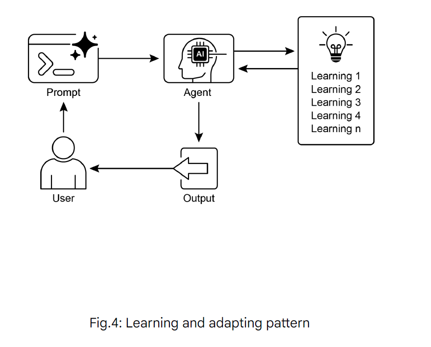

# Learning and Adaptation Design Pattern

## Overview

Learning and adaptation are pivotal for enhancing the capabilities of artificial intelligence agents. These processes enable agents to evolve beyond predefined parameters, allowing them to improve autonomously through experience and environmental interaction. By learning and adapting, agents can effectively manage novel situations and optimize their performance without constant manual intervention.

## The Big Picture

Agents learn and adapt by changing their thinking, actions, or knowledge based on new experiences and data. This allows agents to evolve from simply following instructions to becoming smarter over time.

## Learning Mechanisms

### 1. Reinforcement Learning
Agents try actions and receive rewards for positive outcomes and penalties for negative ones, learning optimal behaviors in changing situations. 

**Use Cases:**
- Agents controlling robots or autonomous systems
- Game-playing agents
- Dynamic resource allocation

### 2. Supervised Learning
Agents learn from labeled examples, connecting inputs to desired outputs, enabling tasks like decision-making and pattern recognition.

**Use Cases:**
- Email classification and sorting
- Trend prediction and analysis
- Content moderation

### 3. Unsupervised Learning
Agents discover hidden connections and patterns in unlabeled data, aiding in insights, organization, and creating a mental map of their environment.

**Use Cases:**
- Data exploration and pattern discovery
- Anomaly detection
- Customer segmentation

### 4. Few-Shot/Zero-Shot Learning with LLM-Based Agents
Agents leveraging LLMs can quickly adapt to new tasks with minimal examples or clear instructions, enabling rapid responses to new commands or situations.

**Use Cases:**
- Quick adaptation to new domains
- Task generalization with minimal training data
- Rapid prototyping of new capabilities

### 5. Online Learning
Agents continuously update knowledge with new data, essential for real-time reactions and ongoing adaptation in dynamic environments.

**Use Cases:**
- Real-time recommendation systems
- Fraud detection systems
- Streaming data analysis

### 6. Memory-Based Learning
Agents recall past experiences to adjust current actions in similar situations, enhancing context awareness and decision-making.

**Use Cases:**
- Personalized user experiences
- Context-aware assistance
- Historical pattern recognition

## Adaptation Strategies

Agents adapt by changing strategy, understanding, or goals based on learning. This is vital for agents in unpredictable, changing, or new environments.

## Advanced Learning Algorithms

### Proximal Policy Optimization (PPO)

Proximal Policy Optimization (PPO) is a reinforcement learning algorithm used to train agents in environments with a continuous range of actions, like controlling a robot's joints or a character in a game. Its main goal is to reliably and stably improve an agent's decision-making strategy, known as its policy.

The core idea behind PPO is to make small, careful updates to the agent's policy. It avoids drastic changes that could cause performance to collapse. Here's how it works:

1. **Collect Data**: The agent interacts with its environment (e.g., plays a game) using its current policy and collects a batch of experiences (state, action, reward).

2. **Evaluate a "Surrogate" Goal**: PPO calculates how a potential policy update would change the expected reward. However, instead of just maximizing this reward, it uses a special "clipped" objective function.

3. **The "Clipping" Mechanism**: This is the key to PPO's stability. It creates a "trust region" or a safe zone around the current policy. The algorithm is prevented from making an update that is too different from the current strategy. This clipping acts like a safety brake, ensuring the agent doesn't take a huge, risky step that undoes its learning.

In short, PPO balances improving performance with staying close to a known, working strategy, which prevents catastrophic failures during training and leads to more stable learning.

### Direct Preference Optimization (DPO)

Direct Preference Optimization (DPO) is a more recent method designed specifically for aligning Large Language Models (LLMs) with human preferences. It offers a simpler, more direct alternative to using PPO for this task.

#### Traditional PPO-based Alignment (Two-Step Process):

1. **Train a Reward Model**: First, you collect human feedback data where people rate or compare different LLM responses (e.g., "Response A is better than Response B"). This data is used to train a separate AI model, called a reward model, whose job is to predict what score a human would give to any new response.

2. **Fine-Tune with PPO**: Next, the LLM is fine-tuned using PPO. The LLM's goal is to generate responses that get the highest possible score from the reward model. The reward model acts as the "judge" in the training game.

This two-step process can be complex and unstable. For instance, the LLM might find a loophole and learn to "hack" the reward model to get high scores for bad responses.

#### The DPO Approach (Direct Process):

DPO skips the reward model entirely. Instead of translating human preferences into a reward score and then optimizing for that score, DPO uses the preference data directly to update the LLM's policy.

It works by using a mathematical relationship that directly links preference data to the optimal policy. It essentially teaches the model: "Increase the probability of generating responses like the preferred one and decrease the probability of generating ones like the disfavored one."

In essence, DPO simplifies alignment by directly optimizing the language model on human preference data. This avoids the complexity and potential instability of training and using a separate reward model, making the alignment process more efficient and robust.

## Implementation Considerations

When implementing learning and adaptation patterns in agent systems, consider:

- **Learning Rate**: Balance between rapid adaptation and stability
- **Memory Requirements**: Efficient storage and retrieval of learned knowledge
- **Computational Resources**: Trade-offs between learning complexity and performance
- **Safety Constraints**: Ensuring learning doesn't lead to harmful behaviors
- **Evaluation Metrics**: Measuring improvement and adaptation effectiveness

## Benefits

- **Autonomous Improvement**: Agents become better without manual intervention
- **Adaptability**: Handle new situations and environments effectively
- **Personalization**: Tailor behavior to specific users or contexts
- **Efficiency**: Optimize performance through experience
- **Robustness**: Better handle uncertainty and changing conditions

## Challenges

- **Stability**: Ensuring learning doesn't destabilize existing capabilities
- **Catastrophic Forgetting**: Maintaining old knowledge while learning new tasks
- **Sample Efficiency**: Learning effectively with limited data
- **Alignment**: Ensuring learning aligns with intended goals and values
- **Scalability**: Managing computational resources as agents learn and grow